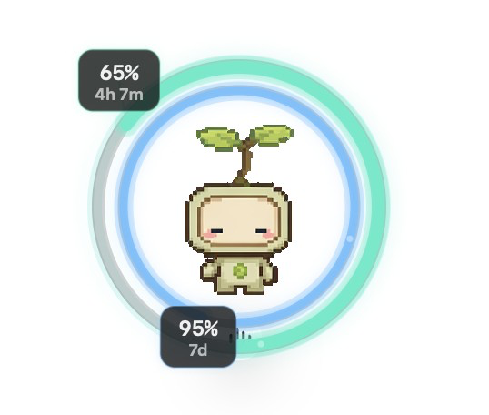

# codex-pet-limit-rings

`codex-pet-limit-rings` is a native macOS companion for Codex pets in the ChatGPT desktop app. It draws glanceable usage-limit rings around the live pet without patching ChatGPT, changing pet art, or copying ChatGPT credentials.


_Privacy-safe v1.0.13 capture on the modern oversized avatar surface. Usage readouts are hidden; the ring and pet alignment is the actual app output._

## Highlights

- The outer ring shows the optional short-window limit remaining.
- The inner ring shows the weekly limit remaining, including weekly-only responses.
- The rings resize and recenter with the current pet and follow it across supported displays.
- Hovering over the pet or rings reveals the exact remaining percentages. The examples below separate the clean non-hover overview from an account-dependent hover readout.
- The menu shows all reported limit buckets, credits, monthly spend controls, reset-credit availability, and freshness without modifying the account.
- Daily Usage summarizes the latest 14 reported account-usage days in memory only.
- Connection Health distinguishes live, cached, local, stale, and reconnecting states with text and non-color markers.
- Optional 25%, 10%, and recovery notifications are local, off by default, and request permission only after opt-in.
- Reduced Motion, Increase Contrast, Differentiate Without Color, English, and Japanese are supported.

### Optional five-hour window example



_Example from an account where the optional five-hour limit is available. The top hover label shows the short-window limit and the bottom label shows the weekly limit. Available buckets, remaining values, and reset times vary by account; the values shown here are illustrative._

When ChatGPT exits or the pet is closed, minimized, or moved off the active Space, the rings disappear instead of remaining at stale coordinates. They return automatically when a supported live pet surface returns.

## Quick Start

The published v1.0.14 app supports Apple silicon on macOS 15 and later. Its ZIP SHA-256 is:

```text
7e4ebe4b43fd9b73ea7668fa5394136736db58b30c95ed633aac09f6bf66bb47
```

Download the ZIP and checksum from the [v1.0.14 release](https://github.com/Driedsandwich/codex-pet-limit-rings/releases/tag/v1.0.14). The bundle is ad-hoc signed and not notarized, so verify the checksum and signature before approving a first launch.

For the complete download, checksum, backup, LaunchAgent, diagnostic, and rollback procedure, follow [Verified Installation And Rollback](docs/verified-installation.md).

To build and install the current source with launch at login:

```bash
tools/install-limit-rings.sh
```

No pet-specific setup is required. The app follows pets presented through the currently tested ChatGPT pet surfaces described below.

## Current Compatibility

This fork preserves the original companion-app boundary and MIT license while extending compatibility for current ChatGPT/Codex desktop builds.

| Area | Current contract |
| --- | --- |
| Pet surfaces | Official `com.openai.codex` process; legacy overlay, named mascot effect, bounded compact pet, centered oversized panel, or the separately verified ChatGPT 26.917 asymmetric drawing panel |
| Placement | Live size and display tracking; bounded desktop pet-width setting and 192-by-208 canvas ratio; transparent drawing-panel bounds never become the interaction target |
| Pet controls | Complete circular, mouse-through rings while preserving normal and contracted ChatGPT pet voice-control hit targets |
| Limit updates | Long-lived experimental app-server connection, sparse live updates, 120-second full-snapshot watchdog, five-second read timeout, and bounded reconnect |
| Performance | Cached file identity, changed-state parsing off the main thread, cached click hit testing, and a 10 fps animation only while effectively visible |
| Distribution | macOS 15+ arm64 ZIP, SHA-256 asset, privacy diagnostics, macOS 15/26 CI, regression tests, packaging checks, and published-artifact smoke tests |

Ordinary ChatGPT windows, Activity Stack, notifications, unrelated processes, off-display surfaces, and unsupported geometry are rejected as pet evidence. The app does not request Screen Recording or Accessibility permission and does not capture pixels while detecting the pet.

See [docs/limit-rings.md](docs/limit-rings.md) for the complete tested surface, rendering, lifecycle, and recovery contract.

The [v1.0.14 specification audit](docs/specification-audit-v1.0.14.md) records the legacy contracts, current compatibility evidence, corrected defects, and verification limits.

## Data And Privacy

The app uses a local stdio connection to the Codex app-server currently bundled with ChatGPT. OpenAI documents [`codex app-server`](https://learn.chatgpt.com/docs/developer-commands?surface=cli#cli-codex-app-server) as experimental and subject to change, so the following methods are a currently tested compatibility contract rather than a permanent API guarantee:

- `account/rateLimits/read` for full rate-limit snapshots.
- `account/rateLimits/updated` for sparse live updates between full reads.
- `account/usage/read` every 15 minutes for the memory-only 14-day usage view.

Local support and fallback inputs are read-only:

- `~/.codex/.codex-global-state.json` for saved pet open-state and geometry hints. Saved state alone never makes the rings visible.
- `~/.codex/config.toml` for only the bounded `[desktop] avatar-overlay-mascot-width-px` value when the oversized surface omits dimensions.
- `CGWindowListCopyWindowInfo` for owner, layer, on-screen state, and geometry metadata—not pixels or control contents.
- The newest existing `~/.codex/sqlite/logs_2.sqlite` or legacy `~/.codex/logs_2.sqlite` as a local fallback when app-server is unavailable.

The app does **not**:

- read `~/.codex/auth.json`, copy ChatGPT bearer tokens, or require an OpenAI API key;
- call the undocumented `backend-api/wham/usage` endpoint;
- consume reset credits, mutate the account, resume or fork threads, or subscribe to per-thread token usage;
- inspect prompts or transcripts, retain thread identifiers, persist usage history, or send screenshots, pet images, prompts, or repository contents anywhere.

Cached, stale, and SQLite fallback values cannot trigger notifications. Privacy-safe diagnostics expose bounded compatibility state without tokens, raw account identifiers, local paths, or raw process output:

```bash
~/Applications/CodexPetLimitRings.app/Contents/MacOS/CodexPetLimitRings --diagnose
```

## Reliability And Recovery

- Sparse notifications never postpone the 120-second monotonic full-snapshot deadline.
- Manual and scheduled reads share one in-flight gate. An unresolved overdue read invalidates the old connection generation before bounded reconnection.
- `Refresh Now` reuses a healthy current connection and creates a fresh connection when disconnected, stale, or timed out.
- A filesystem watcher, official ChatGPT lifecycle events, and a persistent two-second dispatch watchdog restore rings after missed events or an in-place ChatGPT update.
- The packaged LaunchAgent waits on `/usr/bin/open -W` so LaunchServices owns the GUI lifecycle; it does not execute the inner binary directly from launchd.

Product boundaries, update triggers, and deferred scope are recorded in [docs/maintenance-strategy.md](docs/maintenance-strategy.md).

## Install From Source

Install or update the app and LaunchAgent:

```bash
tools/install-limit-rings.sh
```

Run a development build without installing a login item:

```bash
tools/run-limit-rings.sh
```

Remove everything added by the installer:

```bash
tools/uninstall-limit-rings.sh
```

The exact published-app installation and rollback procedure remains in [docs/verified-installation.md](docs/verified-installation.md). The lower-level restoration contract is in [docs/rollback.md](docs/rollback.md).

## Development

Build the app:

```bash
tools/build-limit-rings.sh
```

Run regression tests and the complete local/CI release gate:

```bash
for script in tools/*.sh; do bash -n "$script"; done
tools/test-limit-rings.sh
bash tools/test-release-safety.sh
tools/verify-release.sh
```

Render a static preview from the current source using synthetic offline data:

```bash
deployment_target="$(plutil -extract LSMinimumSystemVersion raw tools/CodexPetLimitRings-Info.plist)"
swiftc -parse-as-library \
  -target "arm64-apple-macosx$deployment_target" \
  tools/codex-pet-limit-rings.swift \
  -o tmp/codex-pet-limit-rings \
  -framework AppKit \
  -framework UserNotifications \
  -lsqlite3
source tools/release-safety.sh
run_release_fixture "$PWD/tmp/codex-pet-limit-rings" "$PWD/tmp/preview-home" --preview tmp/limit-rings-preview.png --size 164
```

Build an ad-hoc-signed release ZIP and checksum under ignored `dist/`:

```bash
tools/package-release.sh
```

CI builds and verifies the current source, smoke-tests pinned v1.0.0 as the long-term provenance baseline, pinned v1.0.9 as the compatibility baseline, and the latest published v1.0.14 artifact. Only v1.0.0 receives its digest-bound pre-v1.0.4 local-path exception. Artifact execution uses synthetic account data; installed-app diagnostics separately verify the real CLI.

Inspect the latest published artifact without replacing the installed app:

```bash
EXPECTED_MIN_OS=15.0 \
EXPECTED_SHA256=7e4ebe4b43fd9b73ea7668fa5394136736db58b30c95ed633aac09f6bf66bb47 \
  tools/smoke-release-artifact.sh 1.0.14 --inspect-only
```

## Give This Repository To Codex

Ask the agent:

```text
Use the bundled codex-pet-limit-rings skill from this repository. Install the rings companion for my Codex pet, verify the LaunchAgent is running, and confirm the rings stay anchored to the pet.
```

The agent should read:

- `AGENTS.md` for the repository contract.
- `skills/codex-pet-limit-rings/SKILL.md` for installation, debugging, and validation.
- `docs/limit-rings.md` for the complete data and rendering model.

Install the bundled Skill into local Codex with:

```bash
tools/install-codex-skill.sh
```

## Repository Map

```text
tools/                               app, install, test, package, and verifier scripts
skills/codex-pet-limit-rings/        reusable Codex-agent workflow
docs/limit-rings.md                  implementation and data-flow contract
docs/verified-installation.md        published install, verification, and rollback runbook
docs/maintenance-strategy.md         product boundary and update triggers
docs/downstream-scope.md             upstream baseline and downstream boundary
experiments/weather-pets/            separate earlier weather-pet experiment
```

## History And Provenance

- [CHANGELOG.md](CHANGELOG.md) records the complete release-by-release history.
- [PUBLICATION_RECORD.md](PUBLICATION_RECORD.md) records publication provenance and release evidence.
- [docs/downstream-scope.md](docs/downstream-scope.md) records the upstream baseline and downstream-only compatibility line.
- [docs/release-notes-v1.0.14.md](docs/release-notes-v1.0.14.md) records the current release scope, artifact identity, and rollback target.

## License

MIT. See [LICENSE](LICENSE).
